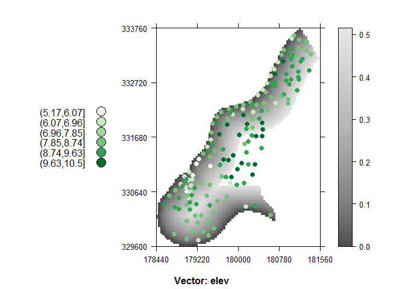
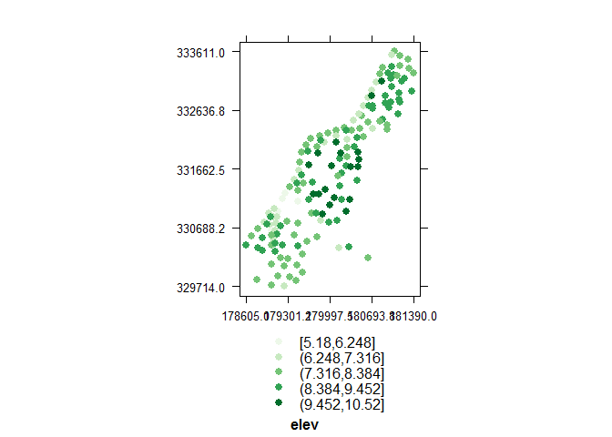

<<<<<<< HEAD
# magicVis
Environmental Informatics  

The following examples illustrate the different plotting functions included in the package.

### mapAttributeOverRaster(...)
 

### mapVectorSimple(...)
 
=======
# magicVis
Visual things for things visual.
>>>>>>> 6432125160e1d5993943c1a2d74cf20c43d2b694
