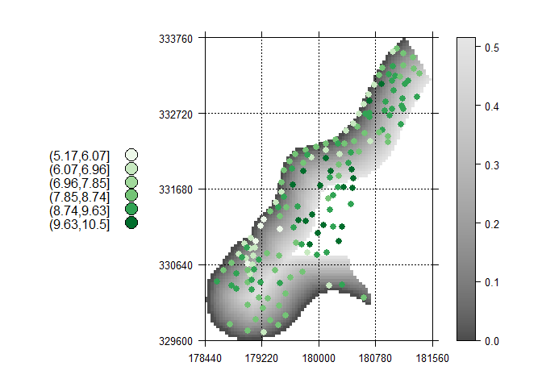

# magicVis Examples
Environmental Informatics  
Tuesday, February 03, 2015  


# mapAttributeOverRaster

```r
library(magicVis)
library(raster)
```

```
## Loading required package: sp
```

```r
library(sp)

data(meuse.grid)
coordinates(meuse.grid) = ~x+y
gridded(meuse.grid) = TRUE
rst <- raster(meuse.grid[3])

data(meuse)
coordinates(meuse) = ~x+y
vec <- meuse[5]

mapAttributeOverRaster(rst, vec, attr = 1)
```

```
## Loading required package: RColorBrewer
## Loading required package: lattice
```

 
